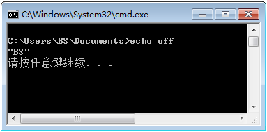
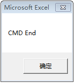

## WScript.Shell 执行bat(exe)

**一览**

* 执行命令字符串
* 执行系统程序
* 执行Bat文件

**相关链接**

1. [WScript.Shell对象的 run()和exec()函数使用详解](http://blog.51cto.com/alany/1568375)

1. [Run方法 - MSDN](https://msdn.microsoft.com/zh-cn/library/d5fk67ky(en-us,VS.85).aspx)

1. [CMD命令](http://blog.csdn.net/liuyukuan/article/details/5974517)

### WScript.Shell.Run

~~~
Run函数有三个参数：
  第一个参数是你要执行的程序的路径，若路径中存在空格，记得要用""括起来。
  如"""C:\Program Files\nn.exe"""的形式或者Chr(34)&"C:\Program Files\nn.exe"&Chr(34)的形式。
  第二个参数是窗口的形式，0是在后台运行；1表示正常运行；2表示激活程序并且显示为最小化；3表示激活程序并且显示为最大化；一共有10个这样的参数如下表。
  第三个参数是表示这个脚本是等待还是继续执行，如果设为了 true，脚本就会等待调用的程序退出后再向后执行。
  其实，Run 做为函数，前面还有一个接受返回值的变量，一般来说如果返回为0，表示成功执行，如果不为0，则这个返回值就是错误代码，可以通过这个代码找出相应的错误。
  另外，如果你使用 Exec 方法的时候，如果希望等待cmd中程序执行完后，再执行后面的语句，也可以通过下面的方法：
  oExec.StdErr.ReadAll() 或者 oExec.StdOut.ReadAll()
  道理上也应该好理解，要得到输出的信息，肯定要 cmd 执行完后才会有输出的。
    
 窗口风格:
  0  隐藏一个窗口并激活另一个窗口。
  1  激活并显示窗口。如果窗口处于最小化或最大化状态，则系统将其还原到原始大小和位置。第一次显示该窗口时，应用程序应指定此标志。
  2  激活窗口并将其显示为最小化窗口。
  3  激活窗口并将其显示为最大化窗口。
  4  按最近的窗口大小和位置显示窗口。活动窗口保持活动状态。
  5  激活窗口并按当前的大小和位置显示它。
  6  最小化指定的窗口，并按照 Z 顺序激活下一个顶部窗口。
  7  将窗口显示为最小化窗口。活动窗口保持活动状态。
  8  将窗口显示为当前状态。活动窗口保持活动状态。
  9  激活并显示窗口。如果窗口处于最小化或最大化状态，则系统将其还原到原始大小和位置。还原最小化窗口时，应用程序应指定此标志。
  10  根据启动应用程序的程序状态来设置显示状态。
~~~
上述内容参照（复制）[相关链接1](http://blog.51cto.com/alany/1568375)

### 执行命令字符串

> VBA代码: 打开C盘，并执行dir命令

~~~
Dim oShell
Set oShell = WScript.CreateObject ("WScript.Shell")
'cmd /K 执行完后续命令后不关闭命令窗口
oShell.Run "cmd /K cd C:\ & Dir" 
Set oShell = Nothing
~~~

### 执行系统程序

> VBA代码1  
> 用记事本程序打开当前运行脚本的副本	

~~~
Set WshShell = WScript.CreateObject("WScript.Shell")
WshShell.Run "%windir%\notepad " & WScript.ScriptFullName
~~~

> VBA代码2  
> 保存记事本关闭时返回的错误码

~~~
Set WshShell = WScript.CreateObject("WScript.Shell")
Return = WshShell.Run("notepad " & WScript.ScriptFullName, 1, true)
~~~

### 执行Bat文件

> VBA代码  
> 执行指定路径下的Bat文件

~~~
Dim ws As Object
Set ws = CreateObject("Wscript.Shell")
'参数2：1的情况下，以正常大小显示命令行窗口
'参数3：True的情况下，等命令行窗口执行完执行后续处理
ws.Run "cmd /c C:\BS\Study\VBA\bat\test.bat", 1, True
DMsgBox "CMD End"
~~~

> Bat文件

~~~
echo off
echo "BS"
pause
~~~

> 执行结果（窗口大小有所调整）  
  

> 按任意键后才会弹出提示窗口  

