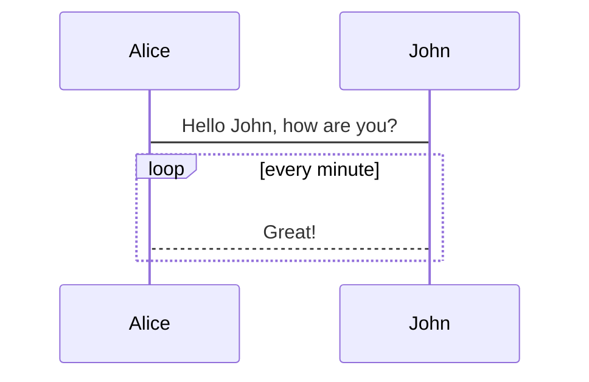
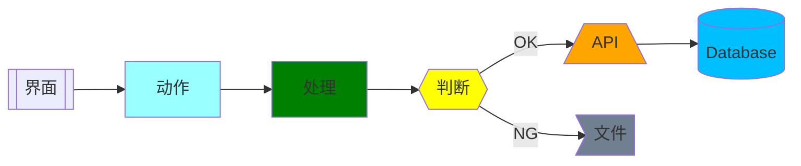
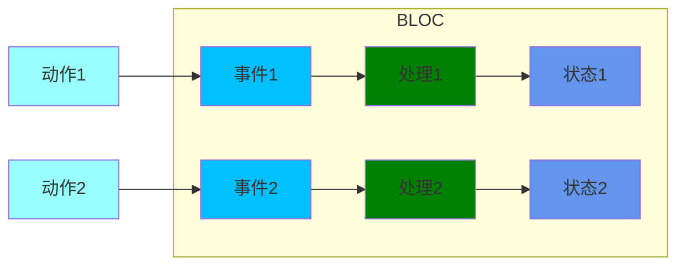

# VuePress

Hello, VuePress.

[VuePress中文文档](https://www.vuepress.cn/)

## VuePress插件

### echarts
<echarts-demo />

### mermaid

[mermaid](https://mermaid-js.github.io/mermaid/#/)

```mermaid
sequenceDiagram
Alice->John: Hello John, how are you?
loop every minute
    John-->Alice: Great!
end
```

```mermaid
graph LR
    page1[[界面]]
    act1[动作]
    proc1[处理]
    api1[/API\]
    cond1{{判断}}
    f1>文件]
    db1[(Database)]

    page1-->act1:::act-->proc1:::proc-->cond1:::cond
    cond1-- OK -->api1:::api-->db1:::db
    cond1-- NG -->f1:::f

    classDef act fill:#99FFFF
    classDef proc fill:green
    classDef api fill:orange
    classDef cond fill:yellow
    classDef db fill:#00BFFF
    classDef f fill:#708090
```

```mermaid
graph LR
    act1[动作1]
    act2[动作2]
    subgraph sub1 [BLOC]
    event1[事件1]
    proc1[处理1]
    state1[状态1]
    event2[事件2]
    proc2[处理2]
    state2[状态2]
    event1:::event-->proc1:::proc-->state1:::state
    event2:::event-->proc2:::proc-->state2:::state
    end

    act1:::act-->event1
    act2:::act-->event2

    classDef act fill:#99FFFF
    classDef proc fill:green
    classDef api fill:orange
    classDef event fill:#00BFFF
    classDef state fill:#6495ED
```

